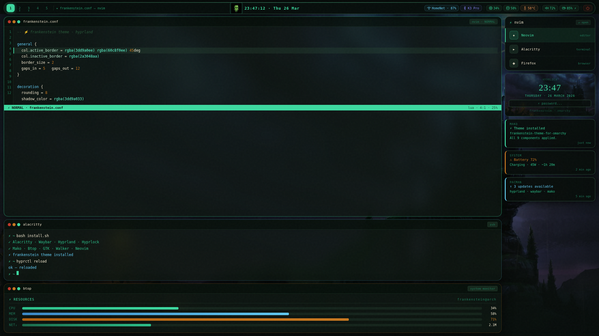
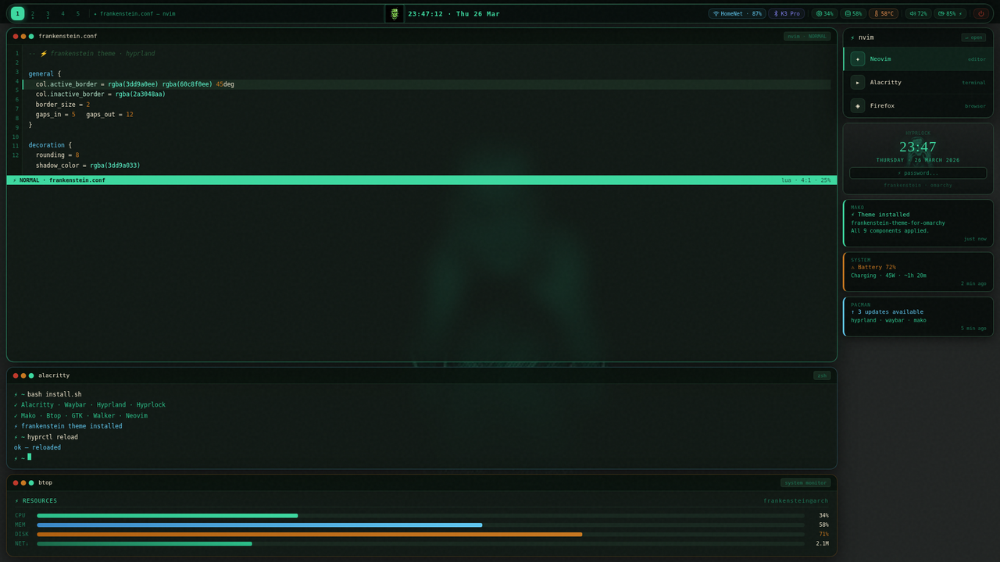

# frankenstein-theme-for-omarchy

Dark theme for [Omarchy](https://omarchy.org). Started from two Frankenstein wallpapers and pulled the colors from there — the teal from the creature, the blue from the castle lightning, the amber from the torches.

Requires Hyprland >= 0.41.




## install

```bash
git clone https://github.com/arthurr-jpg/frankenstein-theme-for-omarchy
cd frankenstein-theme-for-omarchy
bash install.sh
killall waybar && waybar &
hyprctl reload
```

Backs up existing configs before touching anything. Creates `hyprpaper.conf` if you don't have one yet.

**thermal zone** — the temperature module defaults to zone 2. If yours is different, check with `ls /sys/class/thermal/` and update `thermal-zone` in `waybar/config.jsonc`.

## what's in here

- `waybar/` — workspaces, clock with calendar tooltip, wifi, bluetooth, cpu, ram, temp, battery, volume
- `hypr/theme.conf` — borders (teal→blue gradient), blur, animations, dwindle layout
- `hypr/hyprlock.conf` — lock screen on the castle wallpaper
- `alacritty/` — terminal colors
- `mako/` — notifications
- `walker/` — launcher
- `btop/` — system monitor
- `nvim/colors.vim` — colorscheme, works with TreeSitter and LSP
- `gtk/gtk.css` — GTK3 apps
- `backgrounds/` — the two wallpapers

## colors

| hex | role |
|-----|------|
| `#1e2424` | background |
| `#1a3020` | surfaces |
| `#3dd9a0` | primary accent |
| `#2bc08a` | secondary text |
| `#2a4a38` | borders |
| `#60c8f0` | blue accent |
| `#e8e0c8` | text |
| `#c87820` | warnings |
| `#c0392b` | errors |

## neovim

```vim
colorscheme frankenstein
```

## update

```bash
git pull
bash install.sh
killall waybar && waybar &
hyprctl reload
```

---

[arthurr-jpg](https://github.com/arthurr-jpg)
